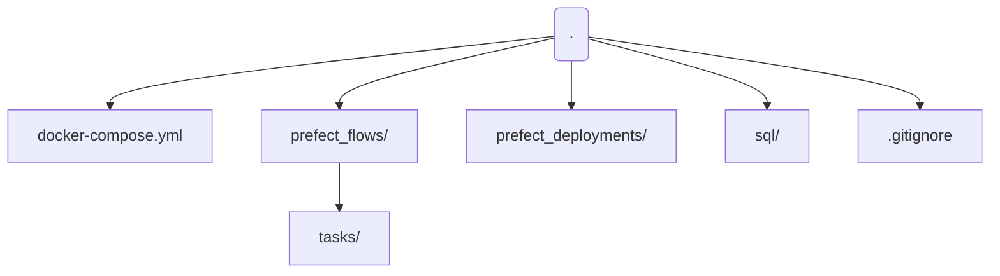

# NYC Taxi Data Engineering Pipeline (ETL + Orchestration)

End-to-end data engineering project using the NYC Taxi dataset. The pipeline extracts the trip data locally, transforms it with Python/Pandas, and loads it into PostgreSQL. Prefect is used for orchestration and Docker is used for containerized infrastructure.

## Key Features
- Modular ETL tasks using Prefect
- Containerized PostgreSQL with Docker Compose
- Clean separation between orchestration, transformations, and SQL
- SQL-based analytical models
- Designed to run locally or on an Ubuntu VM

## Tech Stack
- **Python** (ETL logic)
- **Pandas** (transformation)
- **Prefect** (Orchestration + deployments)
- **PostgreSQL** (analytical destination / warehouse)
- **Docker / Docker Compose** (infrastructure)

## Project Structure


```mermaid
flowchart LR
    A["NYC Taxi Dataset<br/>(local file / download)"] --> B["Extract<br/>Python"]
    B --> C["Transform<br/>Pandas"]
    C --> D[PostgreSQL (destination warehouse)]
    E[Prefect Flow] --> B
    E --> C
    E --> D
    F[Docker Compose] --> D

```

The pipeline is orchestrated using Prefect, which coordinates extraction, transformation, and loading steps with logging and retries. PostgreSQL runs in Docker and serves as the analytical destination.