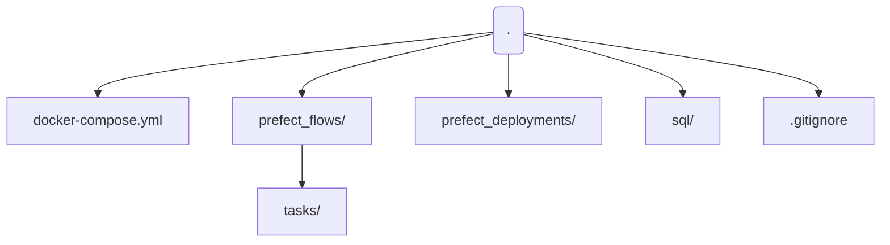

# NYC Taxi Data Engineering Pipeline (ETL + Orchestration)

End-to-end data engineering project using the NYC Taxi dataset. The pipeline extracts the trip data locally, transforms it with Python/Pandas, and loads it into PostgreSQL. Prefect is used for orchestration and Docker is used for containerized infrastructure.

## Tech Stack
- **Python** (ETL logic)
- **Pandas** (transformation)
- **Prefect** (Orchestration + deployments)
- **PostgreSQL** (destination warehouse)
- **Docker / Docker Compose** (infrastructure)

## Project Structure


```mermaid
flowchart LR
A[NYC Taxi Dataset<br/>(local file / download)] --> B[Extract<br/>Python]
B --> C[Transform<br/>Pandas]
C --> D[(PostgreSQL)];
E[Prefect Flow] --> B
E --> C
E --> D
F[Docker Compose] --> D
```
